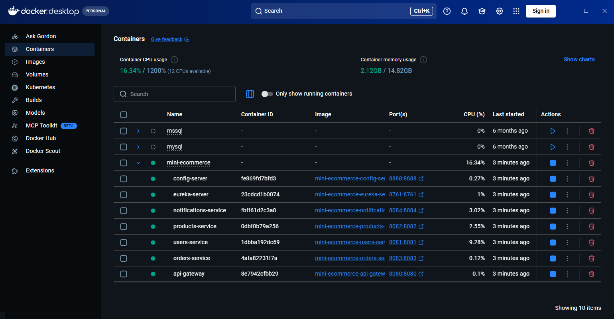
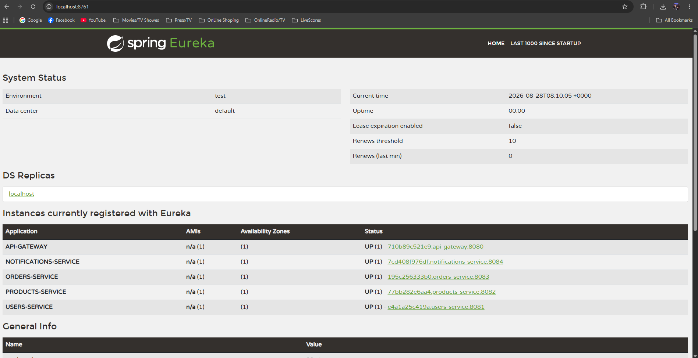
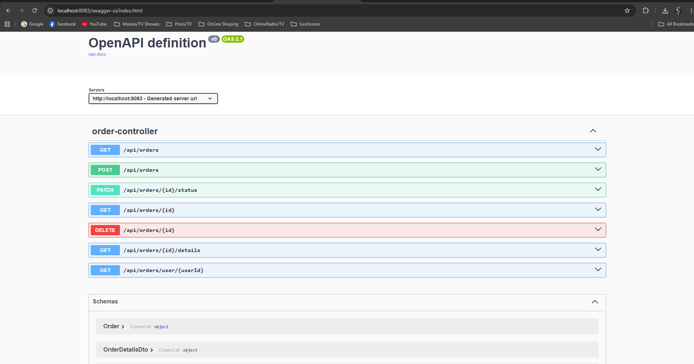
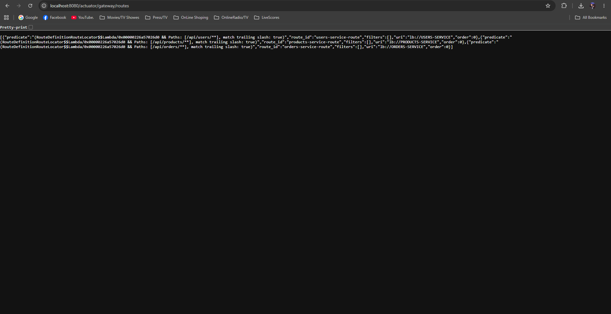
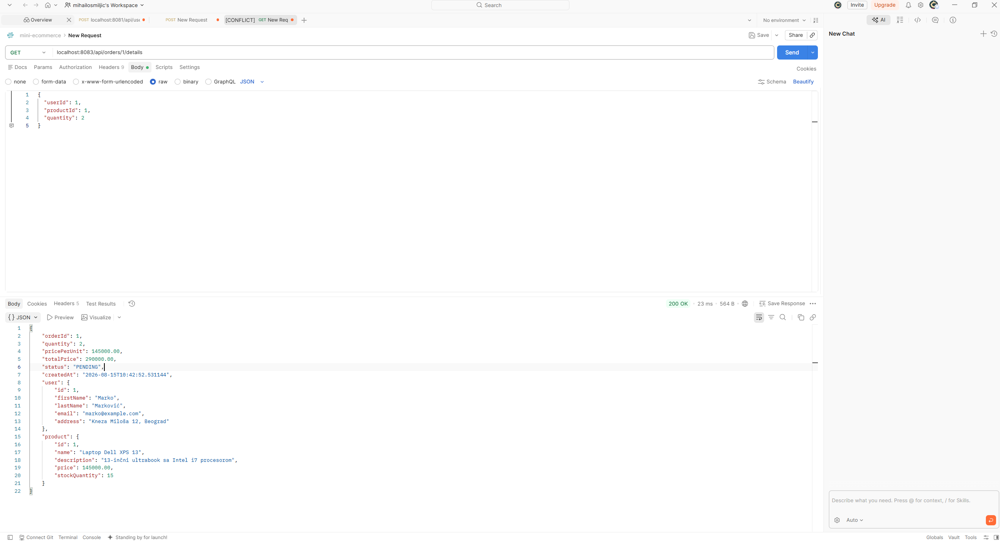
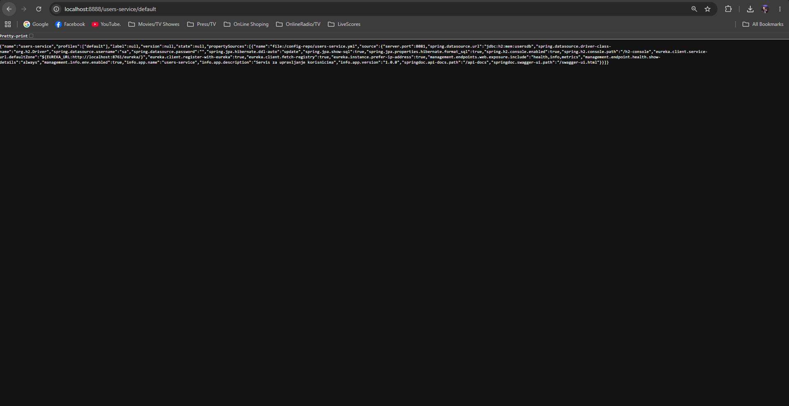
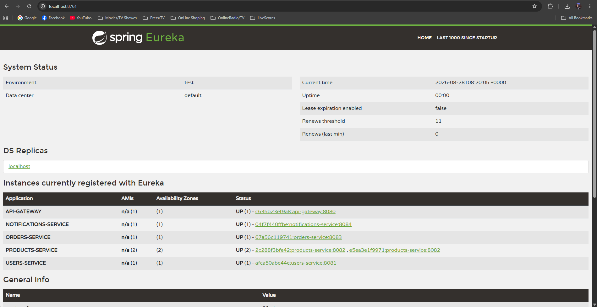
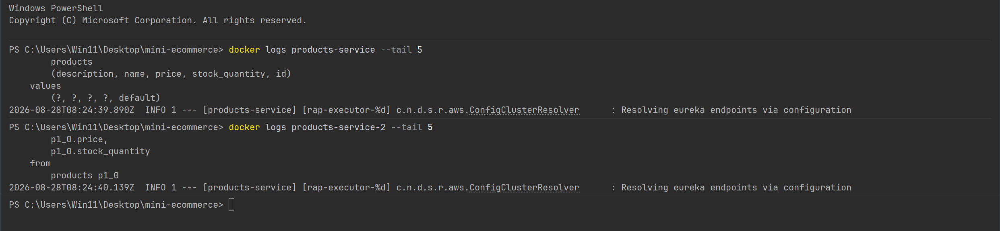
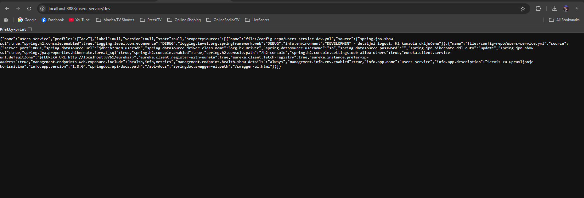
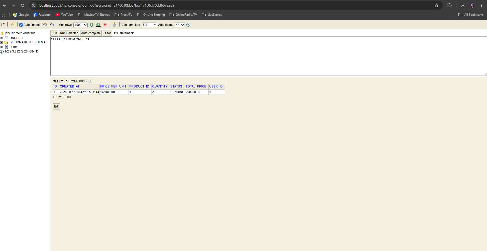

# Mini E-Commerce Mikroservisi

Distribuirani sistem od 7 mikroservisa napravljen sa **Spring Cloud** i **Docker Compose**.  
Sistem simulira osnovnu e-commerce funkcionalnost: korisnici, proizvodi, porudžbine i notifikacije.

**Autor:** Mihailo Smiljic  
**Email:** mihailos2004@gmail.com  
**Predmet:** PDS - Programiranje Distribuiranih Sistema  
**Repository:** https://github.com/MihailoSmiljic/mini-ecommerce

---

## 📋 Sadržaj

- [Arhitektura sistema](#arhitektura-sistema)
- [Korišćene tehnologije](#korišćene-tehnologije)
- [Struktura projekta](#struktura-projekta)
- [Kako pokrenuti](#kako-pokrenuti)
- [Endpoint-i](#endpoint-i)
- [Primer korišćenja](#primer-korišćenja)
- [Otpornost sistema](#otpornost-sistema)
- [Ključne odluke u dizajnu](#ključne-odluke-u-dizajnu)
- [Testiranje kroz H2 konzolu](#testiranje-kroz-h2-konzolu)
- [Napomene za produkciju](#napomene-za-produkciju)

---

## Arhitektura sistema

Sistem se sastoji od **7 container-a** koji rade kao mikroservisi:

| Servis | Port | Opis |
|--------|------|------|
| `config-server` | 8888 | Centralizovana konfiguracija (Spring Cloud Config) |
| `eureka-server` | 8761 | Service discovery (Netflix Eureka) |
| `api-gateway` | 8080 | Jedna ulazna tačka za sve zahteve |
| `users-service` | 8081 | CRUD za korisnike |
| `products-service` | 8082 | CRUD za proizvode |
| `orders-service` | 8083 | CRUD porudžbina + agregacija |
| `notifications-service` | 8084 | Notifikacije za akcije korisnika |

### Kako komuniciraju

- **Klijent** priča **isključivo** sa `api-gateway` na portu 8080
- **Gateway** koristi Eureku da pronađe pravi servis i prosleđuje zahtev
- **Servisi** međusobno pričaju kroz **OpenFeign** (deklarativni HTTP klijent) koristeći Eureka imena servisa
- **Sva komunikacija** između servisa je zaštićena sa **Resilience4j** (Circuit Breaker + Retry + Fallback)
- **Konfiguracija** svih servisa je centralizovana u Config Server-u

### Docker Desktop pregled

Svih 7 container-a pokrenutih iz jedne komande `docker-compose up`:



---

## Korišćene tehnologije

### Obavezne
- **Java 21** (Amazon Corretto)
- **Spring Boot 3.5.4**
- **Spring Cloud 2025.0.0**
- **Netflix Eureka** (Service Discovery)
- **Spring Cloud Gateway** (API Gateway sa `lb://` load balancing-om)
- **OpenFeign** (deklarativni HTTP klijenti)
- **Resilience4j** (Circuit Breaker, Retry, Fallback)
- **Spring Data JPA + H2 Database** (in-memory)
- **Bean Validation** (Hibernate Validator)
- **Spring Boot Actuator** (health, info, metrics)
- **Springdoc OpenAPI** (Swagger UI)

### Opcione (bonus)
- **Spring Cloud Config Server** (native profile, čita iz `config-repo/`)
- **Docker Compose** (orkestracija svih container-a sa healthcheck-ovima)

### Dodatno (bonusi)
- **Globalni exception handling** (`@RestControllerAdvice`)
- **Load balancing** — dve instance products-service-a sa round-robin raspoređivanjem
- **Multi-environment profili** (dev/test/prod)
- **Healthcheck-ovi u Docker Compose** (pravilan redosled pokretanja bez race condition-a)
- **Snapshot pattern** za cenu u porudžbini

---

## Struktura projekta

```
mini-ecommerce/
├── config-repo/                    # centralizovana konfiguracija (YAML)
│   ├── users-service.yml
│   ├── products-service.yml
│   ├── orders-service.yml
│   ├── notifications-service.yml
│   └── api-gateway.yml
├── config-server/                  # Spring Cloud Config Server
├── eureka-server/                  # Netflix Eureka registry
├── api-gateway/                    # Spring Cloud Gateway
├── users-service/                  # CRUD korisnici
├── products-service/               # CRUD proizvodi
├── orders-service/                 # CRUD porudžbine + agregacija + Feign
├── notifications-service/          # notifikacije
├── docs/screenshots/               # ekrani za dokumentaciju
├── docker-compose.yml              # orkestracija svih container-a
└── README.md
```

Svaki servis prati istu Spring Boot strukturu:

```
service/
├── Dockerfile
├── pom.xml
└── src/main/
    ├── java/com/ecommerce/servicename/
    │   ├── ServiceApplication.java
    │   ├── controller/
    │   ├── service/
    │   ├── repository/
    │   ├── model/
    │   ├── dto/
    │   ├── client/            (samo orders-service - Feign klijenti)
    │   └── exception/
    └── resources/
        └── application.yml
```

---

## Kako pokrenuti

### Preduslovi
- **Docker Desktop** (instaliran i pokrenut)
- **Java 21** i **Maven** (za lokalni build)
- **Git**

### Koraci

1. **Kloniraj repo:**

```bash
git clone https://github.com/MihailoSmiljic/mini-ecommerce.git
cd mini-ecommerce
```

2. **Build jar-ove** (kroz IntelliJ Maven tab za svaki servis → `package`, ili terminal):

```bash
cd config-server && ./mvnw package -DskipTests && cd ..
cd eureka-server && ./mvnw package -DskipTests && cd ..
cd users-service && ./mvnw package -DskipTests && cd ..
cd products-service && ./mvnw package -DskipTests && cd ..
cd orders-service && ./mvnw package -DskipTests && cd ..
cd notifications-service && ./mvnw package -DskipTests && cd ..
cd api-gateway && ./mvnw package -DskipTests && cd ..
```

3. **Pokreni ceo sistem:**

```bash
docker-compose up
```

4. **Sačekaj ~2 minuta** dok se svi servisi ne startuju u pravilnom redosledu (healthcheck garantuje pravilan redosled — Config Server prvi, pa Eureka, pa poslovni servisi, pa Gateway).

5. **Proveri Eureka tablu:**
http://localhost:8761


Trebalo bi da vidiš 5 servisa sa statusom UP:



### Zaustavljanje

```bash
docker-compose down
```

---

## Endpoint-i

Svi zahtevi idu **kroz Gateway** na portu **8080**.

### Users
- `GET /api/users` - svi korisnici
- `GET /api/users/{id}` - jedan korisnik
- `POST /api/users` - nov korisnik
- `PUT /api/users/{id}` - izmena
- `DELETE /api/users/{id}` - brisanje

### Products
- `GET /api/products` - svi proizvodi
- `GET /api/products/{id}` - jedan proizvod
- `POST /api/products` - nov proizvod
- `PUT /api/products/{id}` - izmena
- `DELETE /api/products/{id}` - brisanje

### Orders
- `GET /api/orders` - sve porudžbine
- `GET /api/orders/{id}` - jedna porudžbina
- `GET /api/orders/user/{userId}` - porudžbine korisnika
- `GET /api/orders/{id}/details`  - **agregacioni endpoint** (porudžbina + korisnik + proizvod)
- `POST /api/orders` - nova porudžbina (automatski šalje notifikaciju)
- `PATCH /api/orders/{id}/status?status=CONFIRMED` - izmena statusa
- `DELETE /api/orders/{id}` - brisanje

### Notifications
- `GET /api/notifications` - sve notifikacije
- `GET /api/notifications/user/{userId}` - notifikacije korisnika
- `POST /api/notifications` - nova notifikacija (obično poziva orders-service automatski)

### Swagger UI za orders-service

Sve endpoint-e sa mogućnošću direktnog testiranja:



### Gateway rute

Gateway automatski rutira zahteve na osnovu putanje:



### Dodatno (za razvoj)
- `http://localhost:8761` - Eureka dashboard
- `http://localhost:8888/{service-name}/default` - Config Server konfiguracija
- `http://localhost:808X/swagger-ui.html` - Swagger za svaki servis
- `http://localhost:808X/h2-console` - H2 baza konzola
- `http://localhost:808X/actuator/health` - health check

---

## Primer korišćenja

### 1. Dodaj korisnika
POST http://localhost:8080/api/users

{
"firstName": "Marko",
"lastName": "Marković",
"email": "marko@example.com",
"address": "Kneza Miloša 12, Beograd"
}
### 2. Dodaj proizvod
POST http://localhost:8080/api/products

{
"name": "Laptop Dell XPS 13",
"description": "13-inčni ultrabook sa Intel i7 procesorom",
"price": 145000.00,
"stockQuantity": 15
}

### 3. Napravi porudžbinu
POST http://localhost:8080/api/orders

{
"userId": 1,
"productId": 1,
"quantity": 2
}


**Iza kulisa** (u jednom pozivu):
1. Orders-service dobija zahtev
2. Feign poziv → users-service (provera korisnika)
3. Feign poziv → products-service (provera + uzimanje cene)
4. Snimi porudžbinu sa snapshot cenom i izračunatim total-om
5. Feign poziv → notifications-service (automatska notifikacija)
6. Vraća porudžbinu klijentu (201 Created)

### 4. Agregacioni endpoint 

Ovo je **srce projekta** — jedan poziv koji spaja podatke iz 3 servisa:
GET http://localhost:8083/api/orders/1/details

Vraća porudžbinu + pun objekat korisnika + pun objekat proizvoda:



### 5. Config Server servira konfiguraciju

Sve konfiguracije servisa su centralizovane. Primer za users-service:

Vraća porudžbinu + pun objekat korisnika + pun objekat proizvoda:


### 5. Config Server servira konfiguraciju

Sve konfiguracije servisa su centralizovane. Primer za users-service:
GET http://localhost:8888/users-service/default



---

## Otpornost sistema

Sistem koristi **Resilience4j** za otpornost na padove servisa.

### Konfiguracija (u `config-repo/orders-service.yml`)

- **Circuit Breaker:** otvara se ako 50% od poslednjih 10 poziva padne, ostaje otvoren 30s
- **Retry:** 3 pokušaja sa 500ms pauzom između
- **Fallback:** vraća delimičan/rezervni odgovor umesto greške

### Ključna arhitekturna odluka — `ResilientClientService`

Resilience4j anotacije **moraju biti u zasebnom Spring bean-u** zbog **Spring AOP self-invocation problem-a**. Anotacije rade kroz proxy koje Spring omotava oko bean-ova, ali proxy može da presretne samo pozive **između** bean-ova, ne unutar iste klase.

Zato je logika izdvojena u `ResilientClientService`, a `OrderService` ga poziva kao zavisnost.

### Demo — šta se dešava ako neki servis padne

```bash
docker stop notifications-service
```

Onda POST porudžbinu:


---

## Otpornost sistema

Sistem koristi **Resilience4j** za otpornost na padove servisa.

### Konfiguracija (u `config-repo/orders-service.yml`)

- **Circuit Breaker:** otvara se ako 50% od poslednjih 10 poziva padne, ostaje otvoren 30s
- **Retry:** 3 pokušaja sa 500ms pauzom između
- **Fallback:** vraća delimičan/rezervni odgovor umesto greške

### Ključna arhitekturna odluka — `ResilientClientService`

Resilience4j anotacije **moraju biti u zasebnom Spring bean-u** zbog **Spring AOP self-invocation problem-a**. Anotacije rade kroz proxy koje Spring omotava oko bean-ova, ali proxy može da presretne samo pozive **između** bean-ova, ne unutar iste klase.

Zato je logika izdvojena u `ResilientClientService`, a `OrderService` ga poziva kao zavisnost.

### Demo — šta se dešava ako neki servis padne

```bash
docker stop notifications-service
```

Onda POST porudžbinu:
POST http://localhost:8080/api/orders

**Rezultat:**
- Porudžbina se uspešno pravi (201 Created)
- U orders-service log-u: `⚠️ Notifikacija nije poslata (notifications-service ne odgovara)`
- **Sistem nastavlja da radi** — jedan servis je pao, ostali rade i vrše svoj posao

Vrati nazad: `docker start notifications-service`

---

## Ključne odluke u dizajnu

### 1. Database per Service
Svaki servis ima **svoju H2 bazu** (`usersdb`, `productsdb`, `ordersdb`, `notificationsdb`). Nema deljenja tabela između servisa — pravilo mikroservisne arhitekture.

### 2. Snapshot pattern za cenu
`Order` čuva `pricePerUnit` u trenutku porudžbine. Ako se cena proizvoda kasnije promeni, porudžbina i dalje pokazuje pravu cenu koja je bila u trenutku kupovine.

### 3. DTO umesto deljenih Entity klasa
`orders-service` koristi `UserDto`, `ProductDto` i `NotificationDto` (obične Java klase bez JPA anotacija) umesto da kopira Entity klase iz drugih servisa. Time se izbegava sprežna veza (tight coupling).

### 4. Spring AOP self-invocation
Resilience4j anotacije su izdvojene u `ResilientClientService`, ne u `OrderService`. Razlog: Spring proxy može da presretne samo pozive **između** bean-ova, ne unutar iste klase.

### 5. `spring.config.import` umesto `bootstrap.yml`
U Spring Boot 3.x, `bootstrap.yml` je zamenjen sa `spring.config.import` u običnoj `application.yml`. Prefix `optional:` znači da servis radi i bez Config Server-a (fallback na lokalnu konfiguraciju).

### 6. Docker healthcheck-ovi
Umesto samo `depends_on`, koristim healthcheck-ove sa `condition: service_healthy`. Time izbegavam **race condition** — servisi ne startuju dok njihove zavisnosti nisu stvarno spremne. Gateway čeka da svi poslovni servisi budu healthy pre nego što startuje, čime se izbegavaju 503 greške pri startu.

### 7. Load balanced routing kroz Gateway
Gateway koristi `lb://SERVICE-NAME` prefiks umesto direktne URL adrese. Time se dobija automatski load balancing između instanci servisa (round-robin) preko Spring Cloud LoadBalancer-a.

---

## Dodatni bonusi

Pored obaveznih i opcionih tehnologija, sistem implementira i sledeće bonuse.

### Load balancing (više instanci servisa)

Sistem pokreće **dve instance** products-service-a (`products-service` i `products-service-2`), obe registrovane pod istim imenom `PRODUCTS-SERVICE` u Eureki. Spring Cloud LoadBalancer automatski raspoređuje zahteve između njih koristeći round-robin strategiju — bez ikakve promene u kodu, samo dodavanjem nove instance u `docker-compose.yml`.



Kada se pošalje više zahteva na `/api/products`, oni se naizmenično raspoređuju između obe instance. Ovo se jasno vidi u logovima — jedna instanca obrađuje jedan zahtev (npr. INSERT), druga sledeći (npr. SELECT):



**Napomena:** Svaka instanca ima svoju H2 in-memory bazu, pa podaci uneti u jednu nisu vidljivi u drugoj. Ovo demonstrira zašto se u produkciji sve instance istog servisa povezuju na **zajedničku bazu** (PostgreSQL/MySQL) umesto in-memory H2.

### Multi-environment profili

Users-service podržava tri profila konfiguracije: **dev**, **test** i **prod**. Svaki profil ima različite postavke koje se čuvaju u Config Server-u (`config-repo/users-service-{profil}.yml`). Profil se aktivira kroz `SPRING_PROFILES_ACTIVE` environment varijablu u `docker-compose.yml`.



| Profil | Logovanje | H2 konzola | SQL prikaz |
|--------|-----------|------------|------------|
| **dev** | DEBUG (detaljno) | uključena | da |
| **test** | INFO (umereno) | uključena | ne |
| **prod** | WARN (minimalno) | isključena | ne |

Ista aplikacija se ponaša drugačije zavisno od okruženja — u razvoju su detaljni logovi i H2 konzola dostupni, dok su u produkciji isključeni iz sigurnosnih i performansnih razloga.

---

---

## Testiranje kroz H2 konzolu

Otvori bilo koju bazu:

- Users: `http://localhost:8081/h2-console` → JDBC URL: `jdbc:h2:mem:usersdb`
- Products: `http://localhost:8082/h2-console` → `jdbc:h2:mem:productsdb`
- Orders: `http://localhost:8083/h2-console` → `jdbc:h2:mem:ordersdb`
- Notifications: `http://localhost:8084/h2-console` → `jdbc:h2:mem:notificationsdb`

User: `sa`, Password: (prazno)

Primer H2 konzole za orders bazu:



**Napomena:** Baze su in-memory (`mem:`) i resetuju se pri svakom restart-u container-a. Za produkciju bi se koristila prava baza (PostgreSQL, MySQL) koja perzistuje podatke.

---

## Napomene za produkciju

Ovo je **razvojno okruženje**. Za produkciju bi trebalo:

- **PostgreSQL/MySQL** umesto H2
- **Config Server sa Git backend-om** umesto native profile (za versioning konfiguracije)
- **Spring Security + JWT** za autentifikaciju i autorizaciju
- **Distributed tracing** (Zipkin, Jaeger) za praćenje zahteva kroz više servisa
- **Centralizovan logging** (ELK stack: Elasticsearch, Logstash, Kibana)
- **RabbitMQ/Kafka** za asinhronu komunikaciju umesto sinhrone Feign
- **Kubernetes** umesto Docker Compose za orkestraciju u produkciji
- **HTTPS** za sve endpoint-e
- **API Rate limiting** na Gateway nivou
- **Monitoring** (Prometheus + Grafana)

---

## Licenca

Projekat je urađen za fakultetske svrhe - **PDS predmet (Programiranje Distribuiranih Sistema)**.

---

**Kontakt autora:** mihailos2004@gmail.com